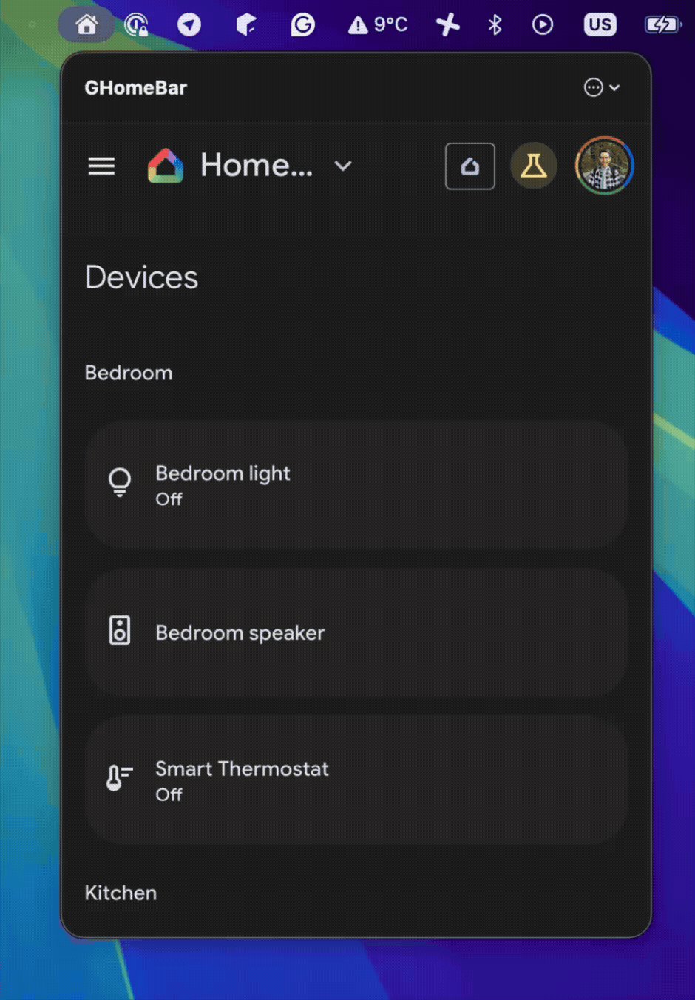
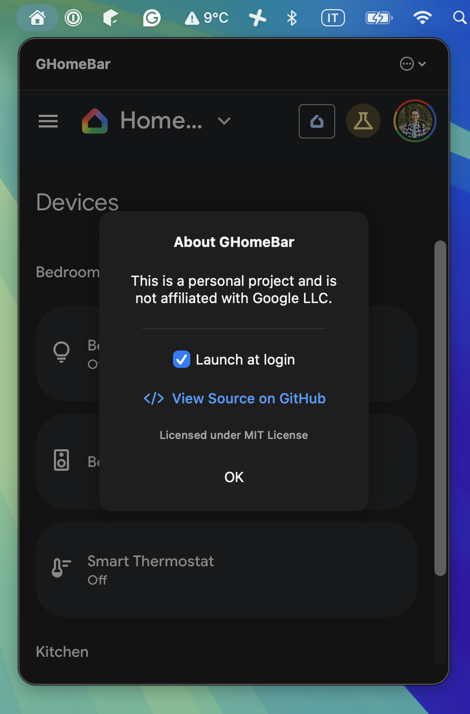

# GHomeBar
A lightweight, macOS menu bar utility for Google Home.
Control your smart home devices on your Mac, without keeping a browser tab open. Based on Google Home [web version](https://home.google.com).


<p align="center">
  
</p>

## Why
There was no way to manage my smart home devices from MacOS... until last year, when Google released a [web version](https://home.google.com) of the Google Home app. Still, it was cumbersome to open a browser every time to turn on a light.

GHome Bar opens a small webview pointing to home.google.com in your menu tray. Once you log in, you can manage your smart devices easily.

## 🛠️ How to install


### Easy: Download and run
1. Open the [Release](https://github.com/paolorotolo/GHomeBar/releases) page
2. Download the most recent version .dmg
3. Run it and drag GHomeBar in Applications

### Note
If you see a warning

> "GHomeBar" is damaged and can't be opened. You should move it to the Trash.

as a workaround, you can run `xattr -cr /Applications/GHomeBar.app` and run the app again

### Advanced: Build from Source
1.  Clone the repository:
    ```bash
    git clone https://github.com/paolorotolo/GHomeBar.git
    ```
2.  Open `GHomeBar.xcodeproj` in Xcode.
3.  Ensure your Signing Team is selected in the Project Settings.
4.  Build and Run (Cmd + R).

*Note: You may need to enable "Outgoing Connections (Client)" in the App Sandbox settings if you are setting up a fresh project.*

## How to use
 1. Make sure you're enrolled in [Google Home Public Preview](https://support.google.com/googlenest/answer/12494697?hl=en) program
 2. At first start, log in to your Google account
    * If you don't see the login page, open the sidebar and tap **Go to Google Home for Web**
 3. Enjoy! Consider enabling "Launch at login" in settings to run GHome Bar automatically on startup

<p align="center">

</p>

## ⚠️ Disclaimer

**This is an unofficial personal project.**

GHomeBar is an independent open-source project created just for fun. It is **not** affiliated with, authorized, maintained, sponsored, or endorsed by Google LLC or any of its affiliates or subsidiaries.

* "Google Home" is a trademark of Google LLC.
* The content displayed within the WebView is rendered directly from `home.google.com`.

## 📄 License

This project is licensed under the MIT License - see the [LICENSE](LICENSE) file for details.

---

### ❤️ Contributing
Pull requests/feature requests are welcome!
